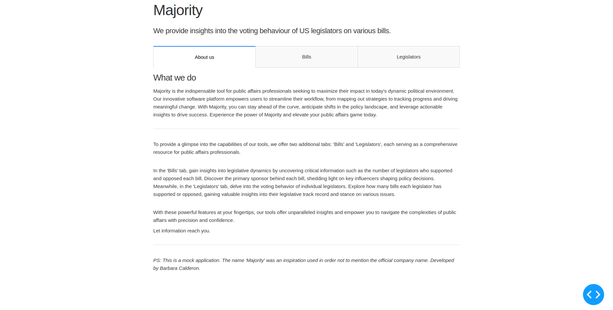
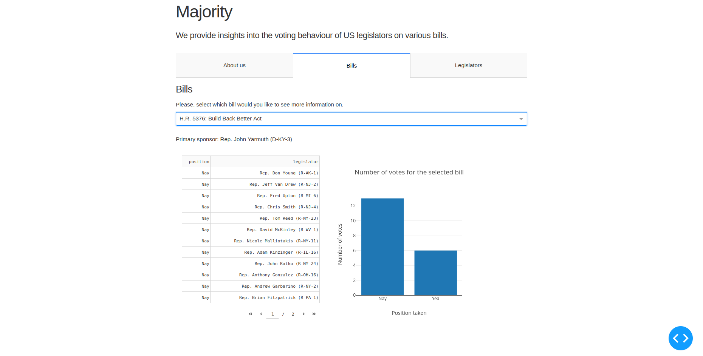
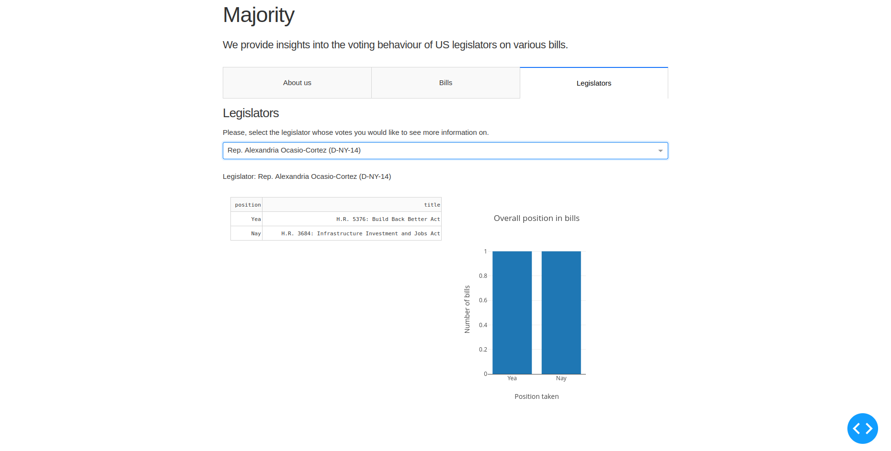

# Majority App

Majority App is a web application built using Dash, a Python framework for building analytical web applications. This application provides insights into the voting behavior of US legislators on various bills, offering valuable information for public affairs professionals and political analysts.



## Author

I'm Barbara Calderon, a software developer from Brazil. 
- [Github](https://www.github.com/barbaracalderon)
- [Linkedin](https://www.linkedin.com/in/barbaracalderondev)
- [Twitter](https://www.x.com/bederoni)

## Features

- **Tab Navigation**: Navigate between different tabs to explore information about the application, bills, and legislators.
- **About Us Tab**: Provides an overview of the application and its capabilities, offering insights into the tools provided.
- **Bills Tab**: Allows users to select a bill and view detailed information, including the primary sponsor and the number of votes for and against the bill.
- **Legislators Tab**: Enables users to select a legislator and explore their voting behavior, including the number of bills they have supported or opposed.

## App Images





## Run Locally

To run the Majority App locally, follow these steps:

Make sure you have Python and Pip installed.

1. Clone the repository:

    ```
    git clone https://github.com/your-username/majority-app.git
    ```

2. Navigate to the project directory:

    ```
    cd majority-app
    ```

3. Install the required dependencies:

    ```
    pip install -r requirements.txt
    ```

4. Run the application:

    ```
    python src/app.py
    ```

5. Access the application in your web browser at [http://127.0.0.1:8050/](http://127.0.0.1:8050/).

## Directory Structure
- `src/`: Contains the main application code.
- `src/data/`: Contains CSV files used for data processing.
- `src/callback_functions.py`: Module containing callback functions for Dash application.
- `requirements.txt`: List of Python dependencies required for the project.
- `README.md`: Instructions and information about the project.

## Technologies Used

- Python
- Pandas
- Dash
- Dash Mantine Components
- HTML
- CSS


## About

The Majority App was developed by myself, Barbara Calderon, as a mock application for educational purposes. It is not affiliated with any official organization or company.
